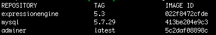
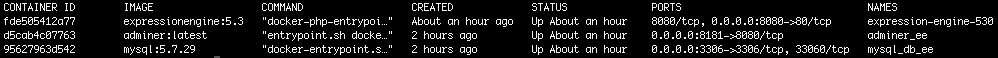
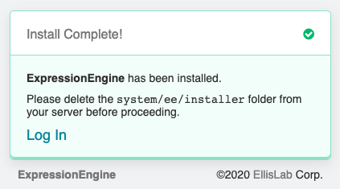
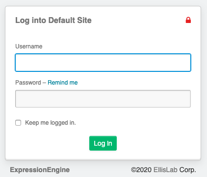
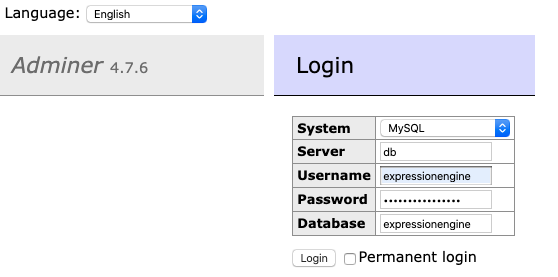

ExpressionEngine Docker Image
========

### How to run with Docker
1. Go to directory with this repo (in console) on your computer
2. Run command `$ docker-compose up -d` it will create three images - `ExpressionEngine`, `Mysql` and `Adminer`. First executing of this command, can take few minutes.  
If you want to change PHP version you can run command  
`$ docker-compose build --build-arg PHP_VERSION=7.4-apache`  
where `7.4-apache` is your version of PHP. After that, you need to re-run containers with command  
`$ docker-compose up -d`  
*All available PHP versions you can find on [docker hub page](https://hub.docker.com/_/php?tab=tags)* 
3. Run command `$ docker images` to check existing images. It should looks like below  
 
4. Check if three containers are running using this command `$ docker ps`. If everything was installed correctly, you should be able to see running containers  
 

Now you have working environment based on Docker. Below are few links, where you can go and start working with ExpressionEngine.

[`http://localhost:8080/admin.php`](http://localhost:8080/admin.php) - ExpressionEngine administration panel  
[`http://localhost:8080`](http://localhost:8080) - Main page  
[`http://localhost:8181`](http://localhost:8181) - Adminer to management MySQL database  

### ExpressionEngine installation
After first time running docker containers, we need to set up ExpressionEngine site. 
1. Got to [`http://localhost:8080/admin.php`](http://localhost:8080/admin.php) page
2. You should have seen installer of ExpressionEngine. Fill required fields with this data: 
 
    **Server Address:** `db`  
    **DB name:** `expressionengine`  
    **DB username:** `expressionengine`  
    **DB password:** `expressionengine`  
    **Email:** `your@email.com`  
    **Username:** `some_user`  
    **Password:** `some_password`  

    I suggest also to check `Install default theme?` option to have some dummy data on a front-end and back-end page.   
    Check checkbox `I agree to the license Terms and Conditions` and click **Install** button.  
    
    After successfully installation, you should be able to see info-box
    
      

3. According to information from install complete box, we need to remove `system/ee/installer` directory. Without that we won't be able to log in into administration panel. To remove this directory, we need to go into docker container with ExpressionEngine page. To do that, go to console and run command:
   
    `$ docker exec -it expressionengine-5.3 bash`  
    
    This command will move you to container console with a path `/var/www/html`. In this console write and execute command:
    
    `$ rm -rf system/ee/installer/`
    
    This command will delete `installer` directory in Docker container. After that you can type `$ exit` in a console to exit from container.
    
    Now if you go to admin panel page [`http://localhost:8080/admin.php`](http://localhost:8080/admin.php) you will get login page
    
     

    You can log in with credentials passed during installation process `Username: some_user` and `Password: some_password`

    Main page url is [`http://localhost:8080`](http://localhost:8080). If you checked `Install default theme?` option during installation, you should be able to see page with some data.
    
### Connection with MySQL database
If you want to connect directly with MySQL database, there is an simple application called `Adminer` included to this ExpressionEngine docker image. If you go to:

[`http://localhost:8181`](http://localhost:8181)

You should've seen login page to MySQL database

 
   
If you fill fields with the data (same as during ExpressionEngine installation process):

**Server:** `db`  
**Username:** `expressionengine`  
**Password:** `some_password`  
**Database:** `expressionengine` 

Click **Login** button and you will connect to database assigned to your ExpressionEngine page. 

### Technologies

**Type** | **Version** |
--- | --- | 
ExpressionEngine | 5.3.0 |
PHP | 7.3.10-apache |
MySQL | 5.7.29 |
Adminer | latest |
